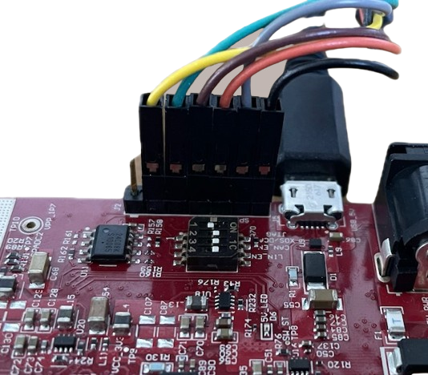

# TI IWRL6432BOOST TI IWRL6432BOOST mmWave radar firmware for streaming radar cube data via SPI

## Project description 
This project is a fork of the [TI IWRL6432 mmWave Radar Minimum Rangeproc DPU Implementation](https://github.com/95lux/ti_iwrl6432boost_dsp) repository which was created as part of a university assignment. 
Goal of this repo is to stream the full 1D radar cube for each frame via SPI in order to achieve higher throughput rates, enabling real-time processing of the data on another device (within certain limitations).

Please note, that there already is an easy way to stream raw ADC data via SPI using the demo project. Please refer to TI's tutorial [here](https://e2e.ti.com/cfs-file/__key/communityserver-discussions-components-files/1023/Steps-for-Raw-ADC-Data-Streaming-in-IWRL6432.pdf).

## Features
- **Enable SPI data streaming of IWRL6432BOOST 1D Radar Cube (Range-FFT) data** 
  - efficiently extract processed data for streaming to another device or a host computer
  - more minimalistic and comprehendable approach than running the full mmwave demo project on the MCU
  - stream already FFT processed data instead of ADC data (the FFT is calculated by the Rangeproc DPU during the `framePeriod`)
- **Compatible with the** [`mmwave-spi-ftdi-reader`](https://github.com/loeens/mmwave-spi-ftdi-reader) **Python module for reading the SPI data**
  - offers streaming of the data via a USB-SPI adapter cable (e.g. C232HM-DDHSL-0) to a host computer
  - easy to use
  - the whole chain (capturing, transferring, parsing) is able to run in real-time up to Radar Cube sizes of approx. 96 KByte
  - build your own radar DSP chain: the data read by the module can then be further processed using radar signal processing libraries such as [OpenRadar](https://github.com/PreSenseRadar/OpenRadar)
- **No CLI, static configuration only**
  - only supports static radar frontend configuration in `defines.h`, which can be generated by the `chirp_config_to_defines.py` script from a `.cfg` file created by the [TI mmWave sensing estimator](https://dev.ti.com/gallery/view/mmwave/mmWaveSensingEstimator/ver/2.4.1/) (tab "Advanced Chirp Design and Tuning")

## Setup
### Hardware
**Warning:** Please make sure to double-check all your actions with the [EVM's user guide](https://www.ti.com/lit/ug/swru596/swru596.pdf?ts=1745662801627) and the [quick start guide](https://dev.ti.com/tirex/content/radar_toolbox_2_20_00_05/.metadata/Getting_Started_With_xWRL6432.html#getting-started-with-xwrl6432) before doing anything. I don't take any responsibility for damaged hardware.
1. **Turn on switch 1.1 and 1.6** (turn others off)
    - Switch 1.1 is for putting the EVM in debug mode, so we can flash the firmware in CCS Theia in debug mode
    - Switch 1.6 is for enabling SPI and the SPI_BUSY GPIO pin aka. LED_SW_GPIO / GPIO_LED_PIN, which is used for synchronyzing the transfer with the host computer the data is streamed to

2. **Connect the USB SPI C232HM-DDHSL-0 cable** (or any other USB SPI cable, but I only can give reference for the C232HM-DDHSL-0)

    Before connecting and powering on, please double check with the [TI documentation](https://software-dl.ti.com/ra-processors/esd/MMWAVE-L-SDK/05_05_00_02/exports/api_guide_xwrL64xx/MOTION_AND_PRESENCE_DETECTION_DEMO.html) (section "Steps to Perform Raw ADC Data Streaming on xWRL6432 FCCSP device").

    | IWRL6432 J2 connector | C232HM-DDHSL-0 wire color |
    | ------------- | ------------- |
    |  VCC 3V       | do not connect  |
    | MOSI          | yellow          |
    | MISO          | green           |
    | CS            | brown           |
    | CLK           | orange          |
    | SPI_BUSY      | grey            |
    | GND           | black           | 
    
    

## How does it work?
Essentially, the SDK function `DPU_RangeProcHWA_control()` triggers a new frame and thus, chirping in the radar frontend. The `DPU_RangeProcHWA_process()` SDK function then processes the ADC data via the rangeproc DPU.

What happens within this code is the following in an endless loop:
- in the `dpcTask` the `DPU_RangeProcHWA_process()` is run, after it completes, it unblocks the `spi_tx_start_sem` semaphore. The `dpcTask` then is blocked by the `spi_tx_done_sem` semaphore
- Once the semaphore is unblocked and the `dpcTask` is blocked, the `spiTask` starts running and transferring the data
    - the task checks, if one radar cube is larger than `MAX_SPI_TRANSFER_SIZE`
      - if the radar cube exceeds this size, it is split into smaller chunks
      - if the full radar cube is smaller, the chunk to be transferred contains the full radar cube
    - chunk by chunk is transferred in an own SPI transaction. Before the actual `MCSPI_transfer()`, the `SPI_BUSY` pin is set to low, indicating to the host that data can be read
    - after the chunk transfer completes, the `SPI_BUSY` pin is set to high again
    - after the transfer is completed, it unblocks the `spi_tx_done_sem` and therefore the `dpcTask` is unblocked
    

## **Brief overview of important source files**

| `/minimal_rangeproc_impl/src/`                  |  |
|-----------------------|-------------|
| [`main.c`](/minimal_rangeproc_impl/src/main.c)             | Initializes hardware, configures the radar sensor, sets up DPUs, and starts FreeRTOS. |
| [`factory_cal.c`](/minimal_rangeproc_impl/src/factory_cal.c)      | Restores and applies factory calibration data from flash memory. |
| [`mem_pool.c`](/minimal_rangeproc_impl/src/mem_pool.c)        | Implements memory pool management functions and data structures. |
| [`mmwave_basic.c`](/minimal_rangeproc_impl/src/mmwave_basic.c)    | Handles mmWave sensor initialization, configuration, and control. |
| [`mmwave_control_config.c`](/minimal_rangeproc_impl/src/mmwave_control_config.c) | Configures chirp and profile settings for TI mmWave radar. |
| [`rangeproc_dpc.c`](/minimal_rangeproc_impl/src/rangeproc_dpc.c)   | Implements the Range Processing DPU (FFT, object detection, SPI transmission). |
| [`spi_transmit.c`](/minimal_rangeproc_impl/src/spi_transmit.c)   | Manages SPI transmission of radar cube data, synchronized via semaphores. |

| `/minimal_rangeproc_impl/include/`           |  |
|--------------|-------------|
| [`system.h`](./minimal_rangeproc_impl/include/system.h)  | Holds most global handles and configs. |
| [`defines.h`](./minimal_rangeproc_impl/include/defines.h)  | Defines chirp parameters (antenna settings, chirp configurations, timing). Configurations can be generated using the [mmWave Sensing Estimator](https://dev.ti.com/gallery/view/mmwave/mmWaveSensingEstimator/ver/2.4.0/) and the [chirp_config_to_defines.py](/scripts/chirp_config_to_defines.py) script. |
